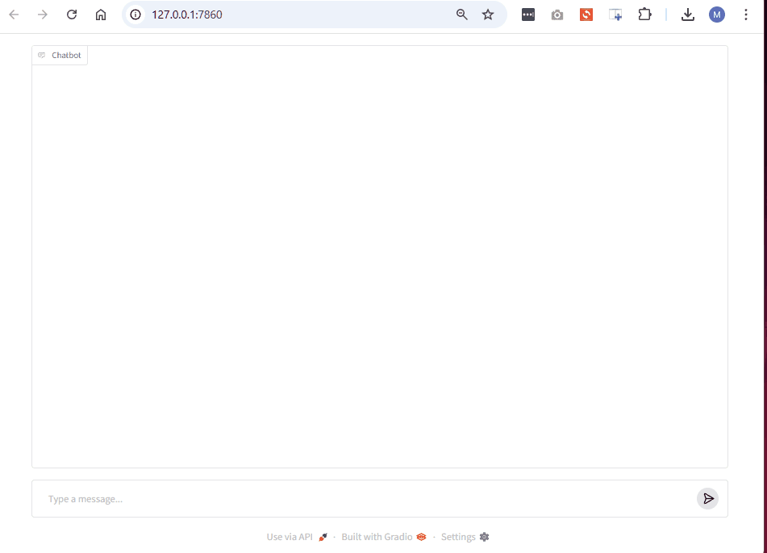

# Lore AI - A Conversational Story Generator

Lore AI is a Python-based project that utilizes large language models (LLMs)
with permanent memory as its context using RAG technique and data stores 
running locally with Ollama, and will not lose its context when page closed 
or refreshed.

## Overview

This project aims to provide a reference for creating AI chat base using local LLM with a specialized context.



_In this example the AI is specialized in universe / lore of The Lord Of the 
Rings_

## Key Features

* ** Local LLM ** Ollama LLM model
* ** Permanent knowledge ** Using RAG and embeddings
* ** Update knowledge ** Provide an update to the lore information such as 
  updated PDF files.

## Getting Started

**Prerequisites:**

*   Python 3.8 or higher
*   Pip (Python package installer)

## Installation

Follow the steps below to set up **Lore AI** on your local system:

1. **Clone the Repository:**  
   Clone the project repository using the following command:
   ```bash
   git clone <repository_url>
   cd <repository_name>
   ```

2. **Set Up a Virtual Environment:**  
   It is recommended to use a virtual environment to avoid dependency conflicts.  
   Create and activate a virtual environment:
   ```bash
   python -m venv venv
   source venv/bin/activate        # On Linux/MacOS
   venv\Scripts\activate           # On Windows
   ```

3. **Install Dependencies:**  
   Install all required Python packages:
   ```bash
   pip install -r requirements.txt
   ```

4. **Install Ollama LLM (if Required):**  
   Ensure you have **Ollama LLM** installed on your system. You can find the installation instructions on their [official website](https://ollama.ai).

5. **Verify Installation:**  
   If everything is set up correctly, you should see the project running.

6. **Setup**

   * ***env*** create .env file in the project root directory and follow the .
     env.example
   
   * ***Lore Data*** Upload your lore data file to 'lore_files' folder
   
   * ***Ingestion*** Run the ingest.py script
   ```bash
   * python ingest.py
   ```

   
   Once the ingestion process is completed, your LLM will use the information 
   for chat.
 

6. **Update Knowledge Base (Optional):**  
   To add or update the knowledge base with PDF documents or other data, follow the instructions in the "Update Knowledge" section of this documentation.


Once completed, you can now start exploring **Lore AI** and use it for your conversational story generation needs.
